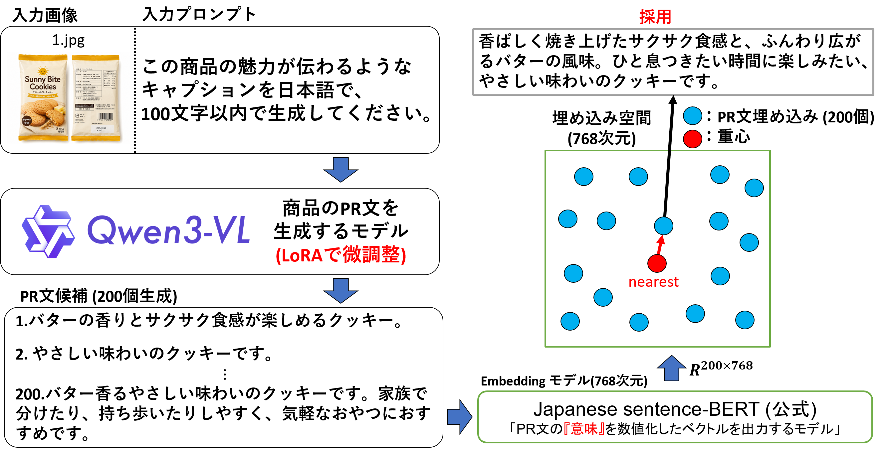

[English](SOLUTION.md) | [日本語](SOLUTION_JA.md)

# 解法と比較実験

本資料では、リヴァンプ × Nishika LLMコンペティションで実際に使用した1位解法と比較実験を説明します。コンペの背景、評価方法、公開範囲は[COMPETITION_JA.md](COMPETITION_JA.md)、実行手順は[README_JA.md](../README_JA.md)を参照してください。

> [!NOTE]
> 本資料はコンペ固有の分析資料です。Apache-2.0の対象ではなく、保存されたCompetition Rulesのコンペ終了後・非営利目的での公開条件に基づいて掲載します。詳しくは[LICENSE_SCOPE.md](../LICENSE_SCOPE.md)を参照してください。

## 解法の要点

最終解法は、生成と選択を分離しています。

1. Qwen3-VL-8B-Instructを4-bit NF4で読み込む
2. 言語層とvisual merger層をLoRAで商品PR文生成に適応する
3. 商品ごとにtemperature 0.9と1.2で各100候補、合計200候補を生成する
4. 主催者提供の評価用テキストエンコーダーで候補を埋め込む
5. 正規化した候補embeddingの重心を計算する
6. 重心に最も近い生成済み候補を最終文として採用する
7. 改行と周囲の記号を除去し、100文字に切り詰める

平均embeddingから文章を復元するのではなく、実際に生成された候補から代表文を選びました。

## 学習設定

現在公開している`code/train.py`の主な設定は次のとおりです。

| 項目 | 設定 |
| --- | --- |
| Base model | Qwen3-VL-8B-Instruct |
| Quantization | 4-bit NF4 |
| Validation | CSV末尾300件 |
| Batch size | 1 |
| Gradient accumulation | 8 |
| Effective batch size | 8 |
| Epochs | 4 |
| Learning rate | `1e-4` |
| LoRA dropout | 0.05 |
| Max sequence length | 2048 |
| Precision | bfloat16 |
| Seed | 42 |

LoRAのrankとalphaは層の役割ごとに変更しています。

| 対象 | Rank | Alpha |
| --- | ---: | ---: |
| Visual deepstack / merger | 16 | 32 |
| Attention (`q/k/v/o_proj`) | 32 | 64 |
| FFN (`gate/up/down_proj`) | 64 | 128 |

コンペ後に作成した解法資料では学習を3 epochsと記録していますが、現在公開しているコードは4 epochsです。3 epochsと4 epochsでsubmitした結果、3 epochsの方が精度が良かったので、そちらを採用しています。

## 推論設定

| 項目 | v1 | v2 |
| --- | ---: | ---: |
| Candidates | 100 | 100 |
| Temperature | 0.9 | 1.2 |
| `top_p` | 0.95 | 0.95 |
| `top_k` | 50 | 50 |
| `max_new_tokens` | 200 | 200 |

`code/marge.py`は両方の候補を結合し、200候補全体の重心に最も近い文を選択します。

## 比較実験

以下はコンペ中またはコンペ終了後に実施した比較実験です。今回のrepository整理時には再実行していません。Leaderboardスコアとコンペ終了後のValidation実験を区別して記載します。

### 実験① Temperatureとensemble

| 生成条件 | 候補数 | 暫定Leaderboard | 最終Leaderboard |
| --- | ---: | ---: | ---: |
| Temperature 0.9 | 100 | 0.6407 | 0.6321 |
| Temperature 1.2 | 100 | 0.6469 | 0.6374 |
| **0.9 + 1.2 ensemble** | **200** | **0.6476** | **0.6397** |

2つの候補群を統合した結果が、公式最終スコア`0.639706`に対応します。記録上、temperature 1.2は0.9より高く、両者のensembleでさらに改善しました。異なるtemperatureにより、安定寄りの候補と多様性の高い候補を同じ選択対象に含められたと解釈しています。

### 実験② 候補数K

temperature 0.9に固定した比較です。

| K | 暫定Leaderboard |
| ---: | ---: |
| 1 | 0.5641 |
| 5 | 0.5917 |
| 10 | 0.6137 |
| 50 | 0.6217 |
| **100** | **0.6407** |

K=1からK=100では`+0.0766`改善しました。候補を増やすことで生成空間を広く探索でき、共通して現れる意味を重心として推定しやすくなった可能性があります。ただし、K=100を超える実験は計算時間の都合で行っていないため、候補数を増やし続ければ改善するとは結論できません。実行環境では、test 1,190件に対するK=100の生成に約2日を要しました。

### 実験③ Vision-Language Model

LoRAおよびコンペデータでの追加学習を行わない条件の比較です。

| Model | Train score | 暫定Leaderboard |
| --- | ---: | ---: |
| Qwen2.5-VL-7B-Instruct | 0.511 | 0.5021 |
| Qwen3-VL-4B-Instruct | 0.509 | 0.4980 |
| **Qwen3-VL-8B-Instruct** | **0.515** | **0.5051** |

比較した中ではQwen3-VL-8B-Instructが最高でしたが、モデル間の差は小さい結果でした。一方、候補数Kや候補選択用encoderの変更ではより大きな差があり、このタスクではbase modelの選択だけでなく、ドメイン適応とinference-time searchが重要だったと考えられます。

### 実験④ 候補選択用Embedding Model

K=100で候補選択用encoderだけを変更した比較です。

| Embedding model | 暫定Leaderboard |
| --- | ---: |
| `sonoisa/sentence-bert-base-ja-mean-tokens` | 0.6120 |
| **主催者提供の評価用encoder** | **0.6407** |

差は`+0.0287`です。評価と候補選択に同じ意味空間を使用するmetric alignmentが大きく寄与したと考えられます。また今回のコンペデータを用いていない一般的なencorder(sonoisa/sentence-bert-base-ja-mean-tokens)を用いても精度上昇が観測できたため、汎用的な手法だと考えられます。主催者提供の評価用encoderは、主催者側でコンペデータを用いて追加学習されたモデルです。本repositoryでは配布しません。

### 実験⑤ 重心からの距離

コンペ終了後、train末尾300件をValidationとして検証した結果です。0%は重心に最も近い候補、100%は最も遠い候補を表します。

| 重心からの距離順位 | Validation score |
| --- | ---: |
| Oracle | **0.7828** |
| **0%（最も近い）** | **0.6167** |
| 10% | 0.5955 |
| 20% | 0.5777 |
| 30% | 0.5645 |
| 40% | 0.5570 |
| 50% | 0.5407 |
| 60% | 0.5335 |
| 70% | 0.5050 |
| 80% | 0.4728 |
| 90% | 0.4289 |
| **100%（最も遠い）** | **0.2245** |

重心から遠くなるにつれてscoreがほぼ単調に低下しており、重心付近の候補が生成分布の安定した意味を捉えるという仮説を支持しています。

Oracleは、生成済み候補の正解scoreを知ったうえで最良候補を選ぶ理論的な値であり、実際の推論では利用できません。nearest centroidの`0.6167`との差は、候補生成よりもrerankingに改善余地が残ることを示唆します。

## 解釈

本解法では、一回の生成に最終品質を委ねず、多数のsampling結果から代表候補を選択しました。候補をembedding空間で平均すると、複数候補に共通する意味は残りやすく、個別のhallucinationや外れ値の影響は相対的に弱くなると考えられます。

さらに、一般的な日本語Sentence-BERTではなく評価用encoderを候補選択にも使用することで、一般的な自然さだけでなく、実際の評価空間に沿った選択が可能になりました。本解法は次の一文に要約できます。

> Generate many candidates, embed them in the competition metric space, and choose the candidate nearest to the centroid.

## 限界と改善余地

- 比較表は単一条件の結果で、複数seedの平均や信頼区間はありません。
- Leaderboard比較では評価対象が完全には同一でない可能性があり、各要素の因果効果を厳密に分離するablationではありません。
- 主催者提供encoderと元コンペデータを配布しないため、このrepositoryだけでは公式スコアを完全再現できません。
- Oracleとの差から、learned reranker、image-text consistency、OCRによる事実整合性確認、cluster/medoid選択などを検討できますが、これらは未検証の将来案です。
- CUDA samplingと学習はbit単位の決定性を保証していません。

本資料は独立した技術アーカイブであり、株式会社リヴァンプおよびNishika株式会社の公式文書ではありません。
